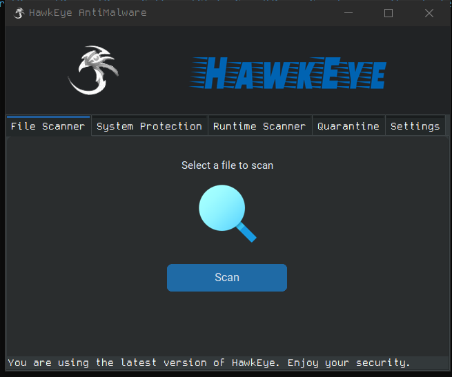
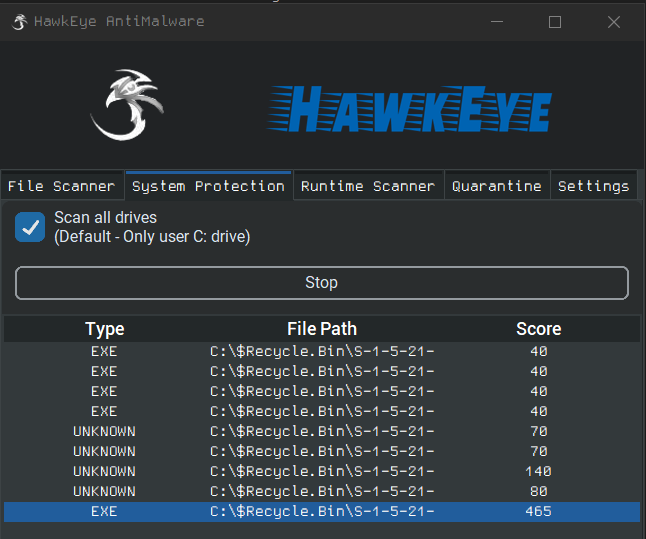
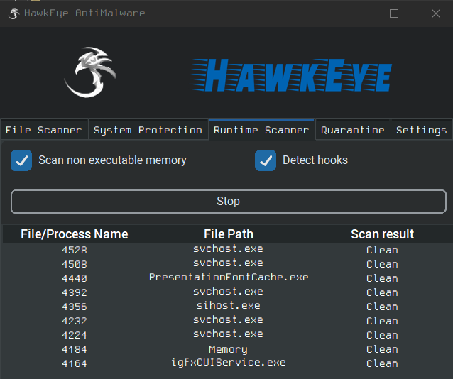
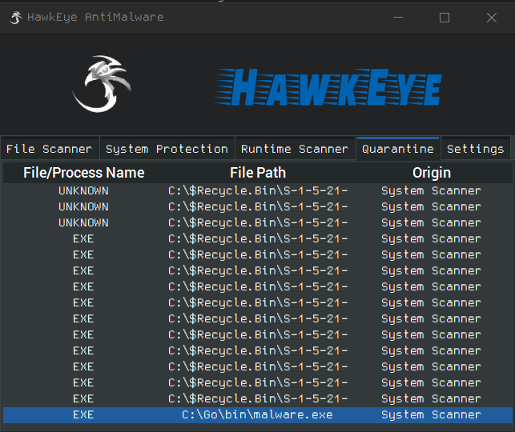
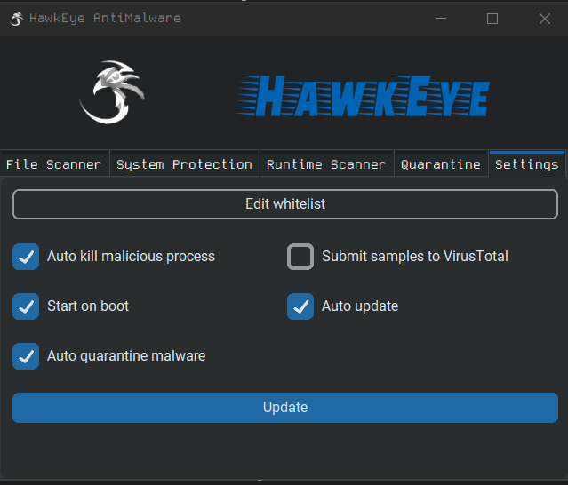

# HawkEye

### Antivirus program made using Python to provide open source security to wide public 

The idea behind this project is to provide an easy to use front end for the open source command line security tools that provide great protection when used on daily basis.
 
1. File Scanner
   - Yara engine is used offline
   - VirusTotal scanner (API key has to be provided)

2. System Scanner
   - Filesystem scanner that uses <a href='https://github.com/Neo23x0/Loki'>Loki</a>
   - Option to scan all computer drives

3. Runtime Scanner
   - Uses <a href='https://github.com/hasherezade/hollows_hunter'>Hollows Hunter</a> under the hood
   - Kills malicious processes and quarantines the infected files

4. Quarantine
   - File name, file path and scan origin is shown
   - Right click menu with "Show file in explorer", "Allow file" and "Delete from computer"

5. Settings
   - Auto kill malicious processes, auto quarantine findings
   - Start on boot (Run key in registry)
   - Auto check for updates (from github)
   - Submit samples to VirusTotal (only applies to File Scanner tab)

### Download
Get the latest version from <a href='https://github.com/DivineSoftware/HawkEye/releases'>releases</a>.

### Some of the planned features are listed here
- [ ] Auto updater for the AV
- [ ] Automatic scanner/scheduled scans
- [ ] Logging or an API
- [ ] Linux version
- [ ] AI powered no distributional scanner

<b>(Please take these as long term goals that might have lower priority than the new projects)</b> 
 
This project is currently in BETA, if you find any bugs, feel free to report them in the <a href='https://github.com/DivineSoftware/HawkEye/issues'>Issues</a> tab
  
<u><b>Credits</b></u> 
<a href='https://github.com/CroatianApoxyomenos'>GUI Author</a> 
<a href='https://github.com/TomSchimansky/CustomTkinter'>CustomTkinter</a> 
<a href='https://github.com/Neo23x0/Loki'>Loki</a> 
<a href='https://github.com/hasherezade/hollows_hunter'>Hollows Hunter</a> 

Follow our <a href='https://github.com/DivineSoftware'>GitHub</a> account to receive latest updates on our open source software releases and be sure to check out our <a href='https://thedivine.one/products/cybarrier/index.html'>0-Day protection</a>.

